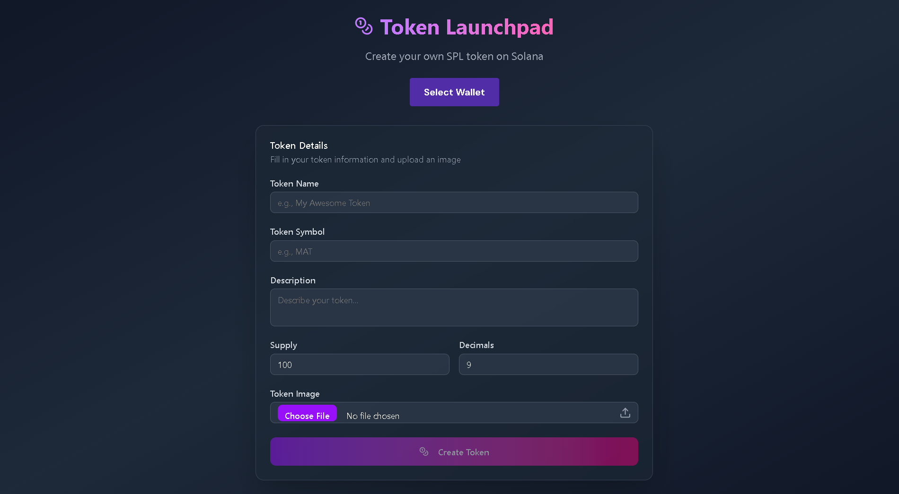

# Solana Token Launchpad



This is a simple, user-friendly decentralized application (dApp) for creating and launching SPL (Solana Program Library) tokens on the Solana blockchain. It provides an intuitive interface for users to define their token's properties, upload an image, and create the token with just a few clicks.

## Features

- **Create Custom SPL Tokens**: Easily create your own SPL tokens on the Solana network.
- **User-Friendly Interface**: A clean and simple UI for a smooth user experience.
- **Wallet Integration**: Connects with popular Solana wallets like Phantom, Solflare, and more.
- **IPFS Integration**: Upload token images and metadata to IPFS using Pinata for decentralized storage.
- **Real-Time Feedback**: The UI provides real-time feedback during the token creation process.

## Technologies Used

- **React**: A JavaScript library for building user interfaces.
- **Vite**: A fast build tool and development server for modern web projects.
- **Solana Web3.js**: The Solana JavaScript API for interacting with the Solana blockchain.
- **Solana Wallet Adapter**: A set of React components for integrating Solana wallets into your dApp.
- **Tailwind CSS**: A utility-first CSS framework for rapid UI development.
- **Pinata**: A service for uploading files to IPFS (InterPlanetary File System).

## Getting Started

### Prerequisites

- [Node.js](https://nodejs.org/) (v16 or later)
- [Yarn](https://yarnpkg.com/) or [npm](https://www.npmjs.com/)
- A Solana wallet (e.g., [Phantom](https://phantom.app/))

### Installation

1. **Clone the repository:**

   ```bash
   git clone https://github.com/your-username/solana-token-launchpad.git
   cd solana-token-launchpad
   ```

2. **Install dependencies:**

   ```bash
   npm install
   # or
   yarn install
   ```

3. **Set up environment variables:**

   Create a `.env` file in the root of the project and add your Pinata JWT token:

   ```
   VITE_PINATA_JWT=your_pinata_jwt_token
   ```

   You can get a Pinata JWT token by signing up on the [Pinata website](https://www.pinata.cloud/).

### Running the Application

To start the development server, run:

```bash
npm run dev
# or
yarn dev
```

Open your browser and navigate to `http://localhost:5173` to see the application in action.

## How It Works

1. **Connect Your Wallet**: Click the "Connect Wallet" button to connect your Solana wallet.
2. **Fill in Token Details**:
   - **Token Name**: The name of your token (e.g., "My Awesome Token").
   - **Token Symbol**: The symbol of your token (e.g., "MAT").
   - **Description**: A brief description of your token.
   - **Supply**: The total number of tokens to be minted.
   - **Decimals**: The number of decimal places for your token.
3. **Upload Token Image**: Select an image for your token. This image will be uploaded to IPFS.
4. **Create Token**: Click the "Create Token" button. The application will:
   - Upload the token image to IPFS.
   - Upload the token metadata (name, symbol, description, image URI) to IPFS.
   - Create the SPL token on the Solana blockchain.
   - Mint the total supply of tokens to your wallet.
5. **Confirmation**: Once the token is created, you will see a success message with the token's address.

## License

This project is licensed under the MIT License.